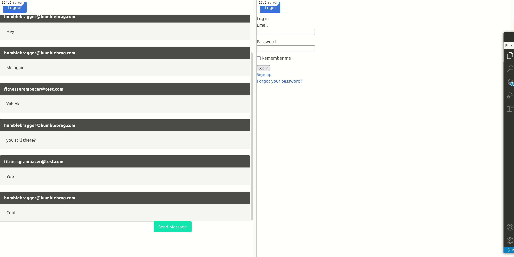

# Action Cable Intro

This is a simple messaging app that shows how Action Cable can be used to enhance an application and give it real time features.

[Link to lesson](https://github.com/TheOdinProject/curriculum/blob/main/rails_programming/mailers_advanced_topics/actioncable_lesson.md)

If running locally, make sure to open a second incognito window to try it out.
Use these test accounts.
 
Email: humblebragger@humblebrag.com  
Password humblebaby  
Email: fitnessgrampacer@test.com  
Password: pacertest  

## Demo

## Features

<ul>
  <li>User authentication using Devise</li>
  <li>Messages are saved to the Database</li>
</ul>

## Installation

Prerequisites: Rails, Git, and Bundler

   1. Clone this repo (Instructions)
   2. Navigate into this project's directory cd flickr-stream
   3. Install the required gems, by running bundle install
   4. Migrate the database, by running rails db:migrate
   5. Seed the database, by running rails db:seed
   6. Start the local server, by running rails server
   7. Open a browser and type http://localhost:3000
   8. Open a second browser in incognito mode and type http://localhost:3000
   9. Chat with yourself!
